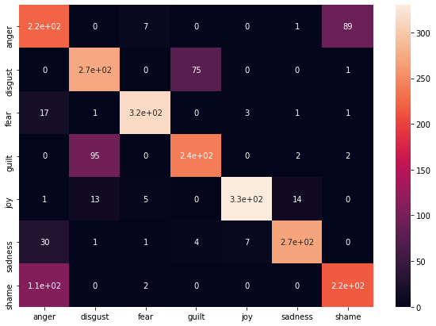

# CLab 21: Group 9 Emotion Classification

Repository for [Jiwon Kim](mailto:st176776@stud.uni-stuttgart.de) and [Lara Grimminger](mailto:st157146@stud.uni-stuttgart.de) for the 2021 Team Laboratory.
Subject: Emotion Classification on the ISEAR Dataset.

## Overview

Emotion classification is the task of classifying the correct emotion given a text.
Here, we have used the research material which was released by the ISEAR (International Survey on Emotion Antecedents and Reactions) project (see [official hompage](https://www.unige.ch/cisa/research/materials-and-online-research/research-material/) #6 for details).
This dataset contains seven emotion labels (anger, disgust, fear, guilt, joy, shame, and sadness) reported by participants' own experiences.
As preliminary research, we experimented with a two-layer fully connected neural network, and due to the imbalanced performance of the model across the labels, we decided to investigate further. You can find the detailed journey in our final report.

Here, we mainly focus on the emotion classification module named `team9`, developed to further our research and make it easily approachable by external users.

## Installation

Install this project from the source by 
```sh
!unzip -qq team9-package.zip -d .
python3 -m pip install --use-feature=in-tree-build -qq team9-package/
```

## Usage

**Before we start, we highly recommend you to go through our demo on [Google Colab](https://colab.research.google.com/drive/1eWcxVjaEadUxoMwy9GCJ9_N9-67ussKC?usp=sharing) which will help you to understand overall architecture easily and quickly :)**


### Python Module (GUI)

On a high level, we provide a python object `team9.Classifier` and the supported features like: *loading data*, *vectorizing/embedding text*, *create model*, *train*, *predict from trained model*, and * analyzing the results*.

Mainly, this module consists of several submodules: [data](./team9/data/) where loading and embedding happens, [model](./team9/model/) which executes actual training and prediction, [interpret](./team9/data/) which provides relevant metrics to evaluate model estimation, and finally [classify]() which integrates the submodules and renders various options to the respective submodules.

Here is the most succinct version of the example, 


### Command Line Intergface (CLI)

We provide a command line interface (CLI) of emotion classification (of the ISEAR dataset, which can be easily extended to other datasets), as well as the python module.

As for additional available arguments, please refer to the following image


The internal mechanism is the same as the python module since we made the command `team9-emo-cls` load the package of the modules used for our task.

## Module Architecture

As we briefly described above, this library is composed of a hierarchical collection of modules corresponding to the process of classification.
You can decompose this library as its subdirectory structure reveals in team9, named `classify`, `data`, `model`, and `interpret`. We will explain how it works individually as well as systematically in the following description.

1. [classify](./team9/classify.py)
Before we move into the submodules, we will explain the main module which is in [team9.classify](./team9/classify). This module is charged for the systematic execution of individual modules. When you initiate this class, it sets the default configuration of the experiment setting. You can easily observe its construction with the command

```python
import inspect
inspect.getmembers(team9.Classifier )
```

Aside from various dunder and private methods, you could see the following options as itself depicting the overall process of classification. 

```sh
 ('get_data', <function team9.data.databunch.DataBunch.get_data>),
 ('get_embedding', <function team9.data.databunch.DataBunch.get_embedding>),
 ('onehot', <function team9.data.databunch.DataBunch.onehot>),
 ('train', <function team9.classify.Classifier.train>)
 ('predict', <function team9.classify.Classifier.predict>),
 ('evaluate', <function team9.classify.Classifier.evaluate>),
```

Additionally, you might have noticed in the above example, that there is no positional argument, which means all arguments have their default value to alleviate difficulties you might confront when you use this package first. However, though it has its own valid default, the program will be broken if you order an invalid variable.

For example, `emb_type=200` when you use `fasttext`, or when you try to use `multinomial naive bayes classification model` (a.k.a. NB) with `pretrained/predict-based embedding`(here we use only fasttext for the trial). The former would evoke 'FileNotFoundError' since, as we will explain in detail later, we provide only 3 choices of embedding the dimension. The latter would result in `ValueError` raised by sklearn library itself, as Naive Bayes classification calculates the chain of probability to decide the estimated label.

When you call the instance after you initiate the instance, which is depicted as `my_classifier(learnig_rate=1e-5)` above GUI example, there comes the part where the submodules `data` and `model` start working. We will continue on this part in the next module.

2. [data](./team9/data)

Functions and datasets we need when we handle (file) data containing texts are all implemented here, and we made the main `Classifier` object to inherit the object called `DataBunch` which conducts input file reading and transforming the raw data. 
Additionally, we use python standard library [pkgutil](https://docs.python.org/3/library/pkgutil.html) when reading package data (ISEAR) so that the program might not be lost in finding out file path in different local's different file structure, as well as interpreting preserved file contents in the process zipped egg archive.

Regarding embedding, we try to incorporate both count/predict embedding methods as we previously discussed in our mid-term presentation. But we use only two models, one is Naive Bayes which is not applicable to fasttext, and the other one is MLP which needs flatten vectors (which will exponentially increase the number of parameters).

Moreover, as the size of pretrained model provided by [fasttext](https://fasttext.cc/docs/en/crawl-vectors.html#models) is up to 6.78GB in English, we decide to extract the embeddings we need. This package gives three choices for embedding dimension found folder [pretrained](.data/pretrained) (format: compressed with zipfile) and separately saved corresponding vocabulary index at separate file [fasttext.vtoi.pkl](./data/pretrained/fasttext.vtoi.pkl).

2. [model](./team9/model)

We adopt two machine learning models which are the most classical NLP classification models but quite different in the way they attempt to find reasonable classification.
For NB, we use [sklearn library](https://scikit-learn.org/stable/modules/naive_bayes.html) without any source code modification. For MLP, we mainly use [tensorflow.keras] API for building 6-layer MLP and it is implemented in [mlp](./team9/model/mlp) module.

3. [interpret](./team9/interpret)

Finally, there are three metrics we incorporate to understand the underlying patterns of various environmental settings.

The first one is [F-Score from sklearn](), arguably one of the most used metrics in the field of classification tasks. Though it has a [controversy on class imbalance](https://direct.mit.edu/neco/article/33/4/853/97475/The-Effect-of-Class-Imbalance-on-Precision-Recall), we have seen that this is not relevant to our dataset.

We also provide a confusion matrix heatmap, which clearly shows which label is confused with another label. For example, you might recognize in the symmetric pattern of the example below that the model (MLP, 6-layer) is mostly confused by guilt/disgust and shame/anger.



To understand the reasons behind our models' predictions, we use an explanation technique called [Local Interpretable Model-agnostic Explanations (LIME)](https://github.com/marcotcr/lime). In the case of text classification, LIME generates a set of scores that indicate the relevance of the word tokens for the classification decision in the text (see example below). LIME further produces heatmaps to visualize the importance of the respective words.


---
---

### Preliminary experiments for the mid-term presentation ###

You can find the labeled ISEAR dataset in the [datasets/emotions](./data/example) directory. The dataset is split into train, validation and test set. Since the respective datasets contained noise and "not provided" text sequences, we have cleaned the datasets and saved them and added "modified" to the respective file names.


### Input and Output Representation

You can find the code for the input and output representation in the [data_preprocessing](https://github.com/SpellOnYou/CLab21/tree/main/data_preprocessing) directory.
We have used tf-idf to convert the text input to numerical input.
We have used one hot encoding to concert the output labels to numerical labels.

### Model Architecture

You can find the code for the model in the [models](https://github.com/SpellOnYou/CLab21/tree/main/models) directory. We opted for a simple 2 layer neural network with a Relu activation function, a Softmax activation function and Cross Entropy Loss.

The script [linear.py](https://github.com/SpellOnYou/CLab21/blob/main/models/linear.py) contains the linear calculations for the neural network.
The script [loss.py](https://github.com/SpellOnYou/CLab21/blob/main/models/loss.py) contains the calculations for softmax and the Cross Entropy loss for the neural network.
The script [model.py](https://github.com/SpellOnYou/CLab21/blob/main/models/model.py) contains the skeleton code for the neural network.
The script [relu.py](https://github.com/SpellOnYou/CLab21/blob/main/models/relu.py) contains the Relu calculations for the neural netwrok.

The main method of our code is the script with the name [multilayer_perceptron.py](https://github.com/SpellOnYou/CLab21/blob/main/multilayer_perceptron.py)

### Evaluation

You can find the code which contains the metrics to evaluate our model in the [metrics](https://github.com/SpellOnYou/CLab21/tree/main/metrics) directory.
We used Precision, Recall and F1 score.


## Usage

To use experiment with your MLP, we recommend you to clone this repository to your local and test in your command line interface(CLI) as following:

```git clone https://github.com/SpellOnYou/CLab21.git <your_repo_name>
cd <your_repo_name>
python multilayer_perceptron.py```

or if you want to track(default:False) the learning status or tune the number of layer size(default:2), simply change the command to

```
python multilayer_perceptron.py trace=True n_layers=4
```

Also, you can find the results of various hyperparameter we've already experimented in the [exp](https://github.com/SpellOnYou/CLab21/tree/main/exp) directory.
We specifically tracked parameters' mean and standard deviation as well as f-score.

Currently we have tested follwing parameter combinations.

Architecture: `2`, `4` and `6-layers` architecture

Max length of features: `100`, `3000`

Batch size: `16`,`32`,`64`

Learning rate: `0.1`, `0.0875`, `0.075`, `0.0625`, `0.05`, `0.0375`, `0.0250`, `0.0125`, `1.00e-10`

Epochs: `1`, `3`, `5`, `7`, `9`, `11`, `13`

## Requirements

numpy version >= 1.19
python version >= 3.6
pytorch version >= 1.0
